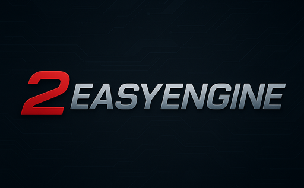

**TwoEasyEngine** is a lightweight 2D library built on
**HTML5 Canvas**, offering a simple, object-oriented API for
scenes, meshes, cameras, and animations.

### Features

- Meshes with geometry and materials (RectGeometry, CircleGeometry)
- Camera support with position, rotation, and zoom (Camera2D)
- Responsive canvas rendering with device pixel ratio support
- Vector transformations (position, rotation, scale)
- Scene management for adding and rendering 2D objects
- Simple animation loop with requestAnimationFrame wrapper
- Written in modern JavaScript with TypeScript type declarations

## Installation

Install **TwoEasyEngine** via npm:

```bash
npm install two-easy-engine
```

Or using Yarn:

```bash
yarn add two-easy-engine
```

## Quick Start
Create an HTML file with the following content to create a basic scene:
```html
<!DOCTYPE html>
<html lang="en">
  <head>
    <meta charset="UTF-8" />
    <meta name="viewport" content="width=device-width, initial-scale=1.0" />
    <style>
      body,
      html {
        margin: 0;
        padding: 0;
        overflow: hidden;
        width: 100%;
        height: 100%;
      }
      #canvas {
        width: 100%;
        height: 100vh;
      }
    </style>
  </head>
  <body>
    <canvas id="canvas"></canvas>
    <script type="module">
      import * as Two from "two-easy-engine";

      // Get the canvas element
      const canvas = document.getElementById("canvas");

      // Create a camera, scene, and renderer
      const camera = new Two.Camera2D();
      const scene = new Two.Scene();
      const render = new Two.Render2D(canvas, scene, camera, {
        width: window.innerWidth,
        height: window.innerHeight,
        devicePixelRatio: window.devicePixelRatio || 1,
        backgroundColor: "black",
      });

      // Create a rectangle mesh
      const mesh = new Two.Mesh(
        new Two.RectGeometry(50, 50),
        new Two.BasicMaterial({
          fillStyle: "#39ff14",
          strokeStyle: "#39ff11",
          lineWidth: 2,
        })
      );
      mesh.transform.position.set(
        window.innerWidth / 2 - mesh.geometry.width / 2,
        window.innerHeight / 2 - mesh.geometry.height / 2
      );
      scene.add(mesh);

      // Handle window resize to ensure responsiveness rendering
      window.onresize = () => {
        mesh.transform.position.set(
          window.innerWidth / 2 - mesh.geometry.width / 2,
          window.innerHeight / 2 - mesh.geometry.height / 2
        );
        render.setSize(window.innerWidth, window.innerHeight);
      };

      // Animation loop
      render.requestAnimationFrame({
        beforeRender: () => {
          mesh.transform.rotation += 0.01; // Rotate the rectangle
        },
      });
    </script>
  </body>
</html>
```

## Development

### Install dependencies

```bash
npm install
```

### Build static files

```bash
npm run build
```

### Run all test

```bash
npm test
```

### Deploy to NPM

```bash
npm run build
npm publish
```

### Docs

```bash
npm run docs:gen # generate docs
npm run docs:dev # dev view
npm run docs:build # build static files
npm run docs:preview # prod. preview
npm run docs:deploy # deploy docs
```

## Contributing

Contributions are welcome! Please open an issue or submit a pull request on GitHub.

## License MIT License

See [LICENSE](/LICENSE.md) for more information.
